# Scrag
**scrag** is a simple script to automate the creation of my _external_ DSL compilers _projects_ written in Ruby.

Then I generally also rely on a second gem to create the abstract syntax (set of classes) using my **rkgen** utility.

